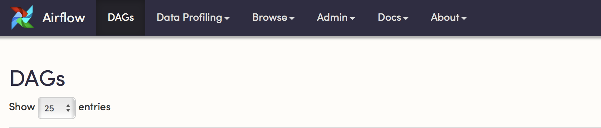
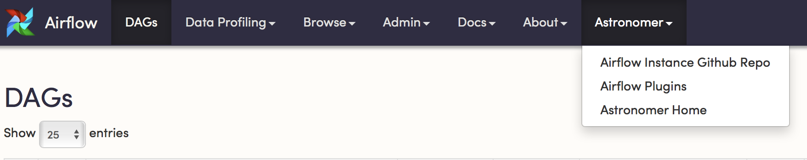

# Modifying the Airflow UI
One of the great aspects of Airflow is the ability to extend the interface to suit the needs of your organization.

## Adding Menu Link Items
Here we'll be walking through a quick example of how you can add additional menu items to the Airflow UI.



To start, we'll import both the Airflow Plugins Manager as well as the MenuLink class from the flask-admin library.
```
from airflow.plugins_manager import AirflowPlugin
from flask_admin.base import MenuLink
```

We're then going to then define a few menu objects that we want to add.
```
github = MenuLink(
    category='Astronomer',
    name='Airflow Instance Github Repo',
    url='https://github.com/astronomerio/astronomer-dags')

astronomer_home = MenuLink(
    category='Astronomer',
    name='Astronomer Home',
    url='https://www.astronomer.io/')

aiflow_plugins = MenuLink(
    category='Astronomer',
    name='Airflow Plugins',
    url='https://github.com/airflow-plugins')
```

Lastly, we're going to import `MenuLink` objects we've defined above into our Airflow Instance using the Airflow Manager.
```
# Defining the plugin class
class AirflowTestPlugin(AirflowPlugin):
    name = "AstronomerMenuLinks"
    operators = []
    flask_blueprints = []
    hooks = []
    executors = []
    admin_views = []
    menu_links = [github, astronomer_home, aiflow_plugins]
```

When we restart the web server, we can see that our plugin has been accepted and the changes have propagated to the menu at the top.


