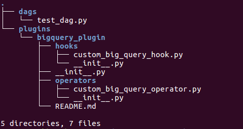
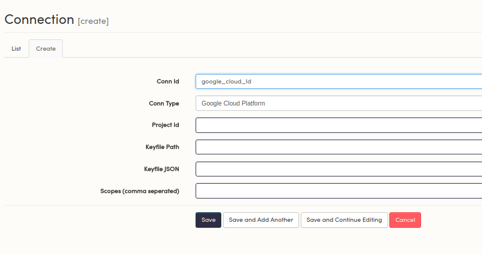

# Using Big Query in Astronomer Airflow

## Start a local version of Astronomer

### Cloud
Run `astro init` to initiatlize a project, and then `astro airflow up` to start a dev environment. 

### Enterprise
Run `astro airflow init` to initiatlize a project, and then `astro airflow start` to start a dev environment. You can put any custom python in `requirements.txt` and any OS-level packages in `packages.txt`

## Import the corresponding BigQuery Plugin

### Cloud
You'll need to clone this modified plugin into your project directory:

`git clone https://github.com/airflow-plugins/bigquery_plugin`

**Note:** _You'll need this extra step because Astronomer Cloud is currently on Airflow 1.8 - once 1.10 releases and we update our cloud image to pull from there, you'll be able to skip this step. To make up for this, there's some additional logging in the custom plugin courtsey of @andrewm4894

Your project directory should look like this:




Now you can import it as you would any other plugin or package:

```
from plugins.bigquery_plugin.operators.custom_big_query_operator import CustomBigQueryOperator
```

### Enterprise:
You can just import the plugin from _airflow.contribs_

```
airflow.contrib.operators.bigquery_operator import BigQueryOperator
```

## Enter the contents of your keyfile in the Admin Panel

In your Airflow UI (localhost 8080), navigate to Admin -> Connections.

If you're on Cloud, you'll put the contents of your keyfile in the `Keyfile Path` field. In Enterprise Edition, put the contents in the `Keyfile JSON` field.


Create a new connection



## Refer to your GCP connection in your DAG

### Cloud


```python
from datetime import datetime
from airflow import DAG
from airflow.operators.dummy_operator import DummyOperator
from plugins.bigquery_plugin.operators.custom_big_query_operator import CustomBigQueryOperator

default_args = {
    'owner': 'airflow',
    'start_date': datetime(2018, 1, 30),
}

dag = DAG('google_cloud_example',
          default_args=default_args,
          schedule_interval='@once')


with dag:
    
    kick_off_dag=DummyOperator(task_id='kick_off_dag')

    bigquery_task = CustomBigQueryOperator(
            task_id='execute_query'
            bql="YOUR SQL HERE",
            destination_dataset_table=my_target_table_full,
            write_disposition="WRITE_TRUNCATE",
            bigquery_conn_id='google_cloud_Id')
    
    kick_off_dag >> bigquery_task
```

### Enterprise


```python
from datetime import datetime
from airflow import DAG
from airflow.operators.dummy_operator import DummyOperator
from airflow.contrib.operators.bigquery_operator import BigQueryOperator

default_args = {
    'owner': 'airflow',
    'start_date': datetime(2018, 1, 30),
}

dag = DAG('google_cloud_example',
          default_args=default_args,
          schedule_interval='@once')


with dag:
    
    kick_off_dag=DummyOperator(task_id='kick_off_dag')

    bigquery_task = BigQueryOperator(
            task_id='execute_query',
            bql="YOUR SQL HERE",
            destination_dataset_table=my_target_table_full,
            write_disposition="WRITE_TRUNCATE",
            bigquery_conn_id='google_cloud_Id')
    
    kick_off_dag >> bigquery_task
```

## Deploy your DAG

### Cloud:
`astro deploy`

### Enterprise:
`astro airflow deploy  YOURNAMESPACE`  

## More Examples:

We're always working to improve our documentation, so feel check back soon for more examples!

We've also found some good ones around the internet:
- https://github.com/alexvanboxel/airflow-gcp-examples
- http://engineering.pmc.com/2017/03/playing-around-with-apache-airflow-bigquery-62/


