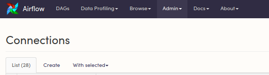

# Using Big Query in Airflow 1.8

## Import the corresponding BigQuery Plugin

You'll need to clone this modified plugin into your project directory:

`git clone https://github.com/airflow-plugins/bigquery_plugin`

Your project directory should look like this:


Now you can import it as you would any other plugin or package:

```
from plugins.bigquery_plugin.operators.custom_big_query_operator import CustomBigQueryOperator
```

## Enter the contents of your keyfile in the Admin Panel

In your Airflow UI (localhost 8080), navigate to Admin -> Connections.

If you're on Cloud, you'll put the contents of your keyfile in either the `Keyfile Path` field or `Keyfile JSON` field, depending on which version you're using.



Create a new connection


## Refer to your GCP connection in your DAG

```python
from datetime import datetime
from airflow import DAG
from airflow.operators.dummy_operator import DummyOperator
from plugins.bigquery_plugin.operators.custom_big_query_operator import CustomBigQueryOperator

default_args = {
    'owner': 'airflow',
    'start_date': datetime(2018, 1, 30),
}

dag = DAG('google_cloud_example',
          default_args=default_args,
          schedule_interval='@once')


with dag:

    kick_off_dag=DummyOperator(task_id='kick_off_dag')

    bigquery_task = CustomBigQueryOperator(
            task_id='execute_query'
            bql="YOUR SQL HERE",
            destination_dataset_table=my_target_table_full,
            write_disposition="WRITE_TRUNCATE",
            bigquery_conn_id='google_cloud_Id')

    kick_off_dag >> bigquery_task
```
